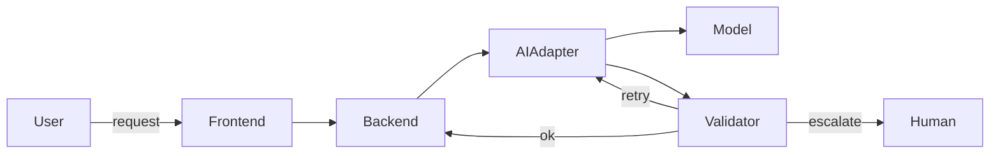

# Project Scaffold for Long-Term AI-Enabled Engineering Teams

This document defines a complete, actionable repository and project plan with concrete examples, templates, and practical rules for long-term maintainability and team collaboration. It is intended for engineers, tech leads, architects, and AI agents.

## 1. Goals and High-Level Principles

### Primary Goal

Create a maintainable, production-grade project scaffold that enables teams and AI agents to work together long-term, supports refactoring as AI models improve, and minimizes developer conflicts.

### Key Principles

SSOT (Single Source of Truth) for architecture, decisions, and shared constants.

KISS: Keep things simple and small; split large functions.

Small tasks: Most tasks ≤ 1 day to enable predictable sprints and easy ticketing.

Clear ownership: work/ppl/<username> directories for each contributor.

ADR-first architecture: All architectural decisions recorded and searchable.

Agent-friendly: ai-instructions.md is the canonical entry point for any agent session.

Refactor-ready: Accept that current AI models are limited; design for iterative refactor and migration.

Deterministic & non-deterministic flows: Support both automated deterministic pipelines and human-in-the-loop non-deterministic processes with monitoring and rollback.

## 2. Short-Term vs. Long-Term Maintenance Considerations
Short-term (0–3 months)

Stabilize repo structure and onboarding docs.

Create initial ADRs for core choices (language, infra, CI).

Implement CI checks for linting, tests, and small static analysis.

Create ticket backlog with tasks ≤ 1 day.

Long-term (3+ months, ongoing)

Continuous ADR updates as models and infra evolve.

Scheduled refactor windows when new AI capabilities arrive.

Migration plan for model upgrades (compatibility layers, feature flags).

Observability and telemetry for AI-driven components.

Periodic architecture reviews and pruning of stale code/ADRs.

Why plan for model weakness now

Current models have limitations (context length, hallucinations, brittleness). The project must be modular so components that rely on models can be replaced or improved without large rewrites.

Design adapters and abstraction layers around AI calls so you can swap models or add orchestration logic later.

## 3. Repository Layout

### Initial Git Project Structure
Top-level tree (use this as git init baseline):

```text
/ (root)
├─ README.md
├─ ai-instructions.md
├─ agent.md
├─ claude.md
├─ prd.md
├─ plan/
│  ├─ README.md
│  ├─ high-level-plan.md
│  ├─ phases.md
│  └─ deep-plan/
│     ├─ README.md
│     ├─ area-authentication/
│     │  ├─ README.md
│     │  ├─ tasks.md
│     │  └─ dod.md
│     └─ area-ai-integration/
│        ├─ README.md
│        ├─ tasks.md
│        └─ dod.md
├─ docs/
│  ├─ onboarding.md
│  ├─ coding-standards.md
│  ├─ architecture.md
│  └─ glossary.md
├─ status/
│  ├─ week-2026-09-13/
│  │  ├─ README.md
│  │  ├─ changes.md
│  │  └─ who-touched-what.md
│  └─ week-2026-09-20/
├─ work/
│  └─ ppl/
│     ├─ README.md
│     ├─ person1/
│     │  ├─ README.md
│     │  ├─ tasks.md
│     │  └─ artifacts/
│     └─ person2/
│        ├─ README.md
│        ├─ tasks.md
│        └─ artifacts/
├─ adrs/
│  ├─ README.md
│  ├─ 0001-choose-language-and-runtime.md
│  ├─ 0002-ci-and-deployment.md
│  └─ 0003-ai-abstraction-layer.md
├─ src/
│  ├─ README.md
│  ├─ app/
│  ├─ libs/
│  └─ tests/
├─ infra/
│  ├─ README.md
│  ├─ terraform/
│  └─ k8s/
├─ constants/
│  ├─ README.md
│  └─ strings.md
├─ helpers/
│  ├─ README.md
│  └─ utils.md
├─ plan-templates/
│  └─ task-template.md
└─ dod/
   ├─ README.md
   └─ phase-1-dod.md
```

### Rules Enforced by the Structure
Rules enforced by structure

Every directory has a README.md explaining how to work with it.

work/ppl/<user> is the only place a person pushes their working artifacts and notes; others may review but should not push into another person's dir.

adrs/ files are numbered and named: 0001-..., 0002-... for easy search and sorting.

ai-instructions.md is the canonical agent entry and exit checklist.

## 4. File Templates and Key Files

### Content Outlines
README.md (root)
Purpose: Project summary, quick start, links to ai-instructions.md, docs/, and plan/.

Sections: Project purpose; How to get started; Where to find ADRs; How to run tests; How to add a new person dir.

ai-instructions.md (most important)
Purpose: The single entry point for any AI agent session. Must be short, explicit, and machine- and human-readable.

Sections:

Context: Short project summary and SSOT pointers.

Task: How to read the task from work/ppl/<user>/tasks.md.

Constraints: Coding standards, file size limits, directory file-count limits (≤ 10 files per dir), no long functions, constants usage.

Session checklist:

Read README.md and relevant ADRs.

Create or update work/ppl/<your-username>/tasks.md with what you did.

Update status/week-YYYY-MM-DD/changes.md.

If you changed architecture, add an ADR draft in adrs/.

Run tests and add results to work/ppl/<your-username>/artifacts/.

Exit actions: Commit changes to your work/ppl/<username> dir; open PR; update status/.

Example: Minimal example of a commit message and PR template.

agent.md and claude.md
Short, agent-specific notes and examples for how to interact with the repo (e.g., prompts, expected outputs). They both point to ai-instructions.md.

adrs/000X-*.md (ADR template)
Filename: 0001-choose-language-and-runtime.md

Content:

Title: Choose language and runtime

Status: Proposed | Accepted | Deprecated

Context: Why decision is needed

Decision: The chosen option

Consequences: What changes, migration steps

Search tags: language, runtime, compatibility

Keep ADRs short: 6–12 lines summary at top for quick scanning.

docs/coding-standards.md (key excerpts)
Code style: Use project linter; small functions; descriptive names.

If conditions: Use boolean variables for complex conditions:

```js
const isExample = xx && yy && zz;
if (isExample) { ... }
```
Functions: Prefer small functions; split when > ~40 lines.

Constants: Repeated strings and immutable objects go to constants/strings.md.

Helpers: Reusable logic goes to helpers/utils.md.

Directory file limit: Prefer ≤ 10 files per directory; if more, create subdirs.

Comments: Minimal; prefer descriptive code. If comment needed, keep it one line and include a short example.

plan/high-level-plan.md
Phases: Discovery, MVP, Hardening, Scale, Continuous Improvement.

Deliverables per phase and DOD references.

plan/deep-plan/<area>/tasks.md
For each area: list of tasks, each task ≤ 1 day, acceptance criteria, DOD link.

dod/phase-1-dod.md
Definition of Done template:

Code compiles and passes tests.

Linting passes.

Documentation updated (README or work/ppl).

ADR created if architecture changed.

PR created and assigned.

Deployment smoke test passes.

## 5. Workflow and Team Rules
Daily/weekly status

Use status/week-YYYY-MM-DD/ to record weekly changes and who touched what.

Each week folder contains who-touched-what.md with lines like:

```text
person1: added src/feature-x; updated adrs/0003-ai-abstraction-layer.md
person2: wrote tests for feature-y; updated docs/coding-standards.md
```
Work ownership

Each contributor must have work/ppl/<username>/README.md with:

Short bio and contact

Current tasks in tasks.md

Artifacts in artifacts/

Contributors only push to their own work/ppl/<username> directory. Shared code goes to src/ via PRs.

PR rules

Small PRs (≤ 200 lines changed preferred).

PR must reference tasks in work/ppl/<username>/tasks.md.

PR template includes checklist: tests, lint, docs, ADR if needed.

Conflict reduction

Personal directories reduce merge conflicts.

Encourage feature branches per task.

Use code owners and small PRs.

## 6. AI Integration and Refactor Strategy
AI abstraction layer

Create src/libs/ai/adapter that exposes a stable interface:

predict(prompt, options)

streamPredict(...)

validateResponse(response, schema)

All model-specific code lives behind adapters so you can swap models or add orchestration.

Validation & guardrails

Use schema validation (JSON Schema, pydantic, or TypeScript types) for AI outputs.

Add a validateResponse step that returns ok|retry|escalate.

Add human-in-the-loop escalation for non-deterministic or risky outputs.

Model upgrade path

Adapter versioning: ai-adapter-v1, ai-adapter-v2.

Feature flags to toggle new model behavior.

Compatibility tests: regression tests that run sample prompts and assert expected structured outputs.

Observability

Log prompts, responses, latency, and validation results (redact PII).

Track hallucination rates and error rates over time.

## 7. Coding Standards and Clean-Code Principles
Naming

Use descriptive names; avoid abbreviations.

Use nouns for types and verbs for functions.

Function size

Prefer functions ≤ 40 lines; split when complexity grows.

Single Responsibility

Each function does one thing.

Constants & helpers

Repeated strings and static objects in constants/strings.md.

Small reusable functions in helpers/utils.md.

Readability

Use boolean variables for complex conditions.

Prefer early returns to nested if blocks.

Examples

Bad

```js
if (a && b && c && d) {
  // do something
}
```
Good

```js
const isReady = a && b && c && d;
if (isReady) {
  // do something
}
```
Refactor patterns

When three functions are often called together, create a single function that composes them.

Keep modules focused; if a directory grows > 10 files, create subdirectories.

## 8. PRD and Blueprint
prd.md

Executive summary.

Goals and success metrics.

User stories and acceptance criteria.

Mermaid diagrams: system overview, data flow, and AI integration flow.

Tables: components, owners, status.

Example mermaid snippet (place in prd.md):



**Blueprint**
- High-level architecture diagram.
- Component responsibilities.
- Migration strategy for future model upgrades.

---

## 9. Tasks, Ticketing, and Definition of Done

**Task template (`plan-templates/task-template.md`)**
- Title
- Owner
- Estimated time (≤ 1 day)
- Steps
- Acceptance criteria
- DOD checklist
- Related ADRs

**How to create tickets**
- After planning, convert each task into a ticket in your tracker (Jira/GitHub Issues).
- Tag with area, priority, and owner.

**DOD examples**
- **Feature task DOD**:
  - Unit tests added and passing.
  - Integration test added.
  - Documentation updated.
  - PR created and reviewed.
- **ADR DOD**:
  - ADR file added to `adrs/`.
  - Short summary added to `docs/architecture.md`.
  - Migration steps documented.

---

## 10. Example Initial ADRs

**`adrs/0001-choose-language-and-runtime.md`**
- Title: Choose language and runtime
- Status: Accepted
- Decision: Use TypeScript/Node 18 for backend; React + TypeScript for frontend.
- Rationale: Strong typing, ecosystem, fast iteration.
- Consequences: CI, linting, and type checks required.

**`adrs/0003-ai-abstraction-layer.md`**
- Title: AI abstraction layer
- Decision: All AI calls must go through `src/libs/ai/adapter`.
- Rationale: Swap models without touching business logic.

---

## 11. Example `work/ppl/person1/tasks.md` Entry

Tasks for person1
2026-09-13: Implemented ai-adapter skeleton in src/libs/ai/adapter.

Files: src/libs/ai/adapter/index.ts

Tests: tests/ai-adapter.test.ts

DOD: unit tests passing; README updated.

קוד

---

## 12. Future Refactors and Model Improvements

**Planned refactor cadence**
- Minor refactors: continuous as PRs land.
- Major refactors (model swap): scheduled windows with migration plan and compatibility tests.

**Compatibility layer**
- Keep a compatibility shim that maps old outputs to new schema for a transition period.

**Automated migration checks**
- Create a suite of golden prompts and expected structured outputs; run them against new models to detect regressions.

---

## 13. Immediate Bootstrap Actions

1. Initialize git repo with the structure above.
2. Add `README.md`, `ai-instructions.md`, `adrs/0001-choose-language-and-runtime.md`.
3. Create `work/ppl/` with at least two example user dirs.
4. Add `docs/coding-standards.md` and `plan/high-level-plan.md`.
5. Create CI pipeline that runs lint, tests, and a small AI adapter smoke test (mocked).
6. Create initial tickets from `plan/high-level-plan.md` tasks, each ≤ 1 day.

---

## 14. Available Deliverables

- Full content for **ai-instructions.md** (recommended first).
- `README.md` root content.
- `docs/coding-standards.md` full file.
- Example ADR files (0001, 0002, 0003).
- `plan/high-level-plan.md` and `plan/deep-plan/area-ai-integration/tasks.md`.
- `prd.md` with mermaid diagrams and tables.

Tell me which file(s) you want me to generate first and I will produce the exact markdown content ready to paste into the repo.