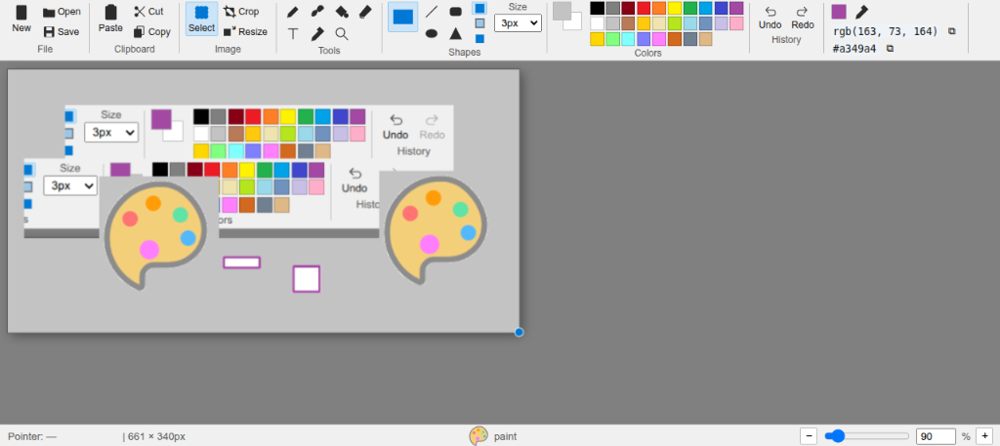
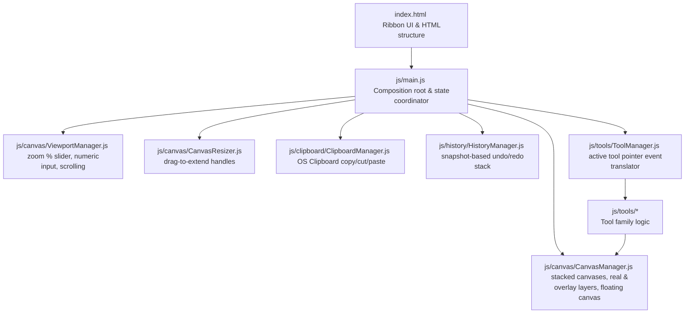

# omerpaint paint online paint like windows but online

A browser-based paint app styled after classic **Windows 10 Paint** (Fluent ribbon, light theme, Segoe UI) — built with plain JavaScript (ES modules), no framework, no build step. Targets **Chrome/Edge** (uses the Async Clipboard API and the File System Access API).



## Running it locally

ES modules need to be served over `http://`, not opened directly as a `file://` path (the browser blocks module imports over `file://`). Pick one:

```bash
# Option A — Node (no install needed beyond npx)
npx serve .

# Option B — Python
python3 -m http.server 8000
```

Then open the printed `localhost` URL in Chrome or Edge.

## Architecture & How It's Built

The application follows a modular, object-oriented design in vanilla JavaScript, leveraging browser API native capabilities. Below is a Mermaid diagram explaining how the components interact:



### Module Breakdown
- **index.html**: Defines the Fluent ribbon layout, the Color Inspector bar, the pointer status bars, and the main canvas stage viewport.
- **js/main.js**: Wires all the managers and tools together. Coordinates selection outline rendering, global keyboard shortcuts, and file actions (New, Open, Save, Crop, Resize).
- **js/canvas/CanvasManager.js**: Handles the two canvas layers: `paint-canvas` (real image pixels) and `overlay-canvas` (selection marquees, shapes previews, caret). Manages the `floatingCanvas` for uncommitted selections.
- **js/canvas/ViewportManager.js**: Handles zoom logic, scale multipliers, mouse-wheel zoom, and updates the zoom percentage input fields.
- **js/canvas/CanvasResizer.js**: Tracks drag events on the bottom-right handles to expand the canvas workspace while preserving existing image contents.
- **js/clipboard/ClipboardManager.js**: Bridges the browser to the OS Clipboard. Supports pasting image blobs directly, copying active selection pixels, and cutting pixels.
- **js/history/HistoryManager.js**: Retains up to 50 snapshots of the canvas for instant undo/redo functionality (`Ctrl+Z` / `Ctrl+Y`).
- **js/tools/ToolManager.js**: Binds to the pointer events and passes scaled coordinate offsets to the active tool.

---

## Core Features

- **Fluent Win10 Ribbon & Layout**: Responsive toolbar controls, shape dropdowns, custom palettes, line size pickers, and status footer.
- **Paint-Style Floating Selection**: 
  - Paste images or drag selected areas to move them.
  - Selections float on the **overlay canvas** without overwriting the background until deselected, committed, or tool switched.
  - Multi-drag support: Dragging and dropping a selection multiple times does not leave white gaps under intermediate positions.
- **Real OS Clipboard Integration**: Supports full-resolution copy/cut/paste directly to and from the OS system clipboard. Pasted images expand the canvas dynamically if they exceed current size.
- **Canvas Resize & Drag-to-Extend**: Drag corner or bottom handles to expand the canvas, or open the **Resize Dialog** with keeping-aspect-ratio option.
- **Crop-to-Selection**: Crop canvas directly to the current bounding box of the active selection marquee.
- **Color Inspector**: Interactive eyedropper tool with a hex/RGB indicator bar that allows copy-to-clipboard actions.
- **50-Step Undo & Redo History**: Complete state history that records image pixels and dimensions on mutated canvas events.
- **Smart Click Deselection**: Clicking anywhere outside the paint area (in the viewport background stage) automatically commits the floating selection and clears selection state.

---

## Keyboard shortcuts

| Key | Action |
|---|---|
| `Ctrl+Z` / `Ctrl+Y` / `Ctrl+Shift+Z` | Undo / Redo |
| `Ctrl+C` / `Ctrl+X` / `Ctrl+V` | Copy / Cut / Paste (real OS clipboard, full resolution) |
| `Ctrl+S` / `Ctrl+O` / `Ctrl+N` | Save / Open / New |
| `S P B F E T K Z` | Select / Pencil / Brush / Fill / Eraser / Text / Eyedropper / Zoom |
| `Ctrl+Scroll` over canvas | Zoom in/out |
| `Esc` (while typing text) | Cancel the text box without committing |
| `Delete` / `Backspace` | Discard active floating selection or clear marquee selection |

---

## Browser support note

Per design choice, this targets **Chrome/Edge** specifically:
- **Async Clipboard API** (`navigator.clipboard.write/read` with `ClipboardItem`) — Baseline 2024, works in current Chrome, Edge, Firefox, and Safari.
- **File System Access API** (`window.showSaveFilePicker`) — Chrome/Edge only. `save()` checks for it and silently falls back to a plain PNG download everywhere else, so the app still works (just without "save back to the same file") in other browsers.
