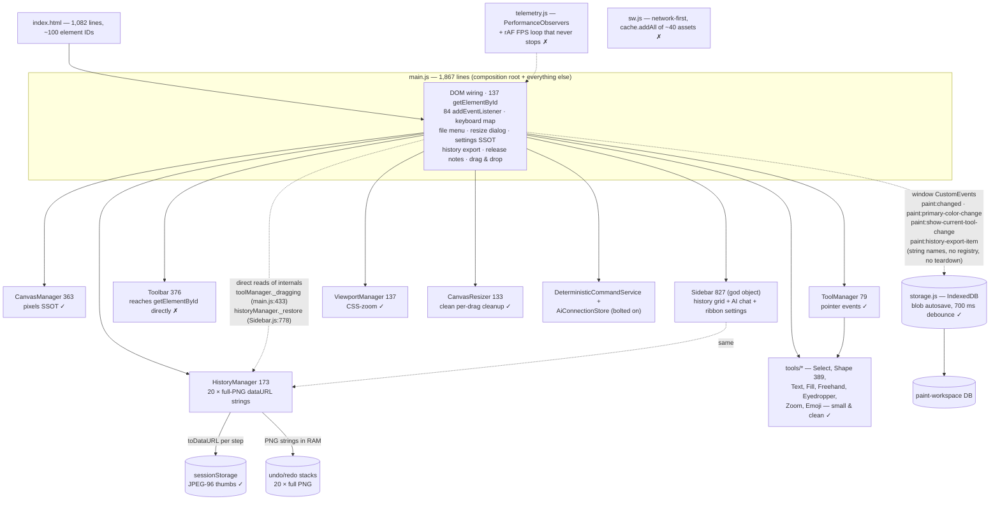
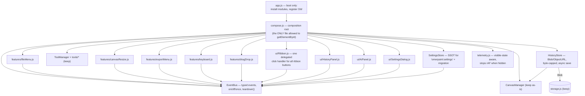

# Paint — Technical Audit & Improvement Plan

> **Audit date:** 2026-09-19 · **App:** `paint/` (Paint Online, v1.5.0 in `package.json`)
> **Scope:** the `paint/` app only (~8,800 LOC). `diff/`, `notepad/`, `litellm/` are separate apps in the workspace and were **not** audited.
> **Tone:** no sugar, a little salty. Every claim below points to a real file/line so you can verify it yourself.
> **Companion:** interactive version at [`audit-report.html`](audit-report.html) (mermaid graphs + sortable tables).

---

## 1. Executive summary

Paint Online is a **structurally better-than-average vanilla JS app** with a genuinely good canvas core (image-pixel SSOT, overlay separation, snapshot-on-stroke-end, an OOM guard on shape measurement). The `.skills/` + `AGENTS.md` contract is a best practice most projects don't have.

But the app is being **held together by a 1,867-line `main.js`** that owns 137 `getElementById` calls and 84 event listeners, a **history system that stores 20 full-resolution PNG strings in RAM**, a **test suite that is currently RED (39/41 passing)** with brittle grep-tests, and a **PWA manifest that cannot pass Lighthouse installability** (SVG-only icon). None of these are hard to fix. All of them block the two goals you stated: high Lighthouse scores for the coming domain launch, and safe future expansion.

### Headline problems (the salt)

| # | Problem | Evidence | Why it hurts |
|---|---------|----------|--------------|
| 1 | Test suite is **red right now** — 2 failures | `node --test`: 41 tests, 39 pass, **2 fail**; smoke.test.js:303 expects missing `docs/COMMUNITY_STANDARDS.md`; smoke.test.js:395 expects `height: min(560px, 88vh)` while `css/styles.css:1695` says `440px` | `npm test` is your only gate (`validation.md` step 2). A red gate = no gate. |
| 2 | **God file** | `js/main.js` = 1,867 lines, 137× `document.getElementById`, 84× `addEventListener` | Violates your own `.skills/architecture.md` ("main.js as composition root"). Every new feature raises the blast radius. |
| 3 | **History eats RAM** | `js/history/HistoryManager.js:6` `MAX_HISTORY = 20`, each entry a full `canvas.toDataURL('image/png')` string (line 57) | 20 × ~2–30 MB strings on a 2000px canvas. On a 6000×6000 canvas this is an out-of-memory crash, not a slowdown. |
| 4 | **PWA icon gap** | `manifest.json:11-18` — single `icon.svg`, `sizes:"any"` | Lighthouse PWA requires a 192px and 512px PNG (maskable). Installability + Lighthouse score lost before you even buy the domain. |
| 5 | **Untyped JS with hidden contracts** | No `jsconfig.json`; `ToolManager._handle` passes `ctx` bag; `main.js:433` reads `toolManager._dragging` from outside | The nastiest bugs you already fixed (phantom selection, `_pendingToolRestore`) are exactly the class TypeScript/JSDoc types catch at edit time. |

### Headline strengths (the sugar you earned)

- **Coordinate model is right**: drawing happens in true image pixels, zoom is a CSS transform (`js/canvas/ViewportManager.js:119-126`) — crisp at any zoom, no re-raster.
- **Overlay vs. pixels separation** (`CanvasManager.js:1-6`): selection/UI never contaminates the saved image.
- **Snapshot on stroke-end, not mousemove** (`HistoryManager.js:2-4`) + **no-change snapshot skip** via pixel signature (`CanvasManager.js:56-71`).
- **Bounded memory thinking already exists**: `MAX_MEASURE_PIXELS` guard (`CanvasManager.js:10-13`), 96px JPEG session thumbs (`HistoryManager.js:142-151`), debounced IDB blob autosave (`js/storage.js:67-78`).
- **The agent contract** (`.skills/*.md`, `AGENTS.md`, `CONTRIBUTING.md`, `SECURITY.md`, PR template) is genuinely good and enforced by tests.
- **No native `alert/confirm/prompt`** — a real dialog service (`js/ui/DialogService.js`), per your own rules.

---

## 2. How this was measured (methodology)

| Method | Command / technique | Result |
|--------|--------------------|--------|
| Listener census | `grep -rc addEventListener paint/js` | **176 total**. Top: `main.js` 84, `ui/Sidebar.js` 26, `ui/Toolbar.js` 22, `ui/PanelLayoutManager.js` 6, `tools/ToolManager.js` 6 |
| Cleanup census | `grep -rn removeEventListener paint/js` | Only 21 hits, concentrated in drag-cleanup paths (`CanvasResizer.js:83-93`, `PanelLayoutManager.js:88-93`, `storage.js:74-77`) — i.e. most "global" listeners (window `paint:*` events, keyboard, drop, telemetry rAF) have **no teardown path at all** |
| Hot-path search | `toDataURL | getImageData | innerHTML | localStorage` | `toDataURL(PNG)` in HistoryManager on snapshot/undo/redo/getSessionEntries; `getImageData` full row-scan in `CanvasManager._alphaBounds:326-350`; 27× `innerHTML=` (audited: all static strings, no user-controlled XSS found) |
| DOM coupling | `grep -c document.getElementById` | `main.js` **137**, `ui/Toolbar.js` **18**, `ui/Sidebar.js` **27** |
| Size map | `wc -l` | `main.js` 1867, `ui/Sidebar.js` 827, `css/styles.css` 2344, `ui/Toolbar.js` 376, `tools/ShapeTool.js` 389 — vs. healthy modules: `ToolManager` 79, `ViewportManager` 137, `DialogService` 64 |
| Test run | `npm test` (node --test) | **41 tests, 39 pass, 2 fail** (see §10 for exact fixes) |
| Contract audit | read `.skills/*.md`, `AGENTS.md`, `sw.js`, `manifest.json`, `robots.txt`, `sitemap.xml`, `tests/*` | See §4 area I and §9 |
| Lighthouse | not yet run — no `lhci` in CI (`.gitlab-ci.yml` only for notepad) | P0 gap; pre-flight checklist in §9 |

**What could NOT be measured here (be honest):** real Lighthouse/CrUX scores, FPS under load, Safari/Firefox behavior, touch-input ergonomics. §9's checklist tells you exactly how to capture those before the domain launch.

---

## 3. Architecture

### 3.1 As-is (what the code actually does today)



**Three structural smells visible in one picture:**
1. `main.js` is simultaneously composition root, keyboard handler, file menu, settings store, export pipeline, and drag-drop controller.
2. Cross-module communication is split between *callbacks* (`onChange`, `onToolChange` — good) and *raw window string events with no registry* — plus **direct reads of other modules' private fields** (`toolManager._dragging` at `main.js:433`, `historyManager._restore` called from `Sidebar.js:778`).
3. `Sidebar.js` is a second god object (history + AI + ribbon-settings in one class).

### 3.2 Target (what to build toward)



Rules for the target (already written down by you — this audit just enforces them):
- Only the composition root touches `document.getElementById`. Everything else receives refs via constructor.
- All `paint:*` window events go through `EventBus` with a **declared, typed name list** (SSOT for event names).
- One module = one reason to change. `Sidebar.js` splits into HistoryPanel / AiPanel / SettingsDialog.
- Modules expose `destroy()`/`off()` so listeners can be cleaned (needed for tests and future multi-document).

---

## 4. Scorecard — ranked

Grade scale: 10 = Lighthouse-ready, production-clean. Ranking = best → worst.

| Rank | Area | Score | One-line verdict | Key evidence |
|------|------|-------|------------------|--------------|
| 1 | Runtime performance (draw path) | **7/10** | Right architecture; small leaks remain | snapshot-on-stroke-end; CSS zoom; but `ToolManager.js:27,44` two `pointermove` listeners, no rAF batching, `getBoundingClientRect` per event (`ViewportManager.js:130`) |
| 2 | UI & CSS quality | **6.5/10** | Strong tokens/dark-mode; monolithic file | `styles.css` 2,344 lines + `progressive.css`; ribbon hides its horizontal overflow from keyboard users (`styles.css:66-71`) |
| 3 | SEO / PWA / Lighthouse readiness | **6/10** | Metadata excellent; PWA & perf budget gaps | canonical+OG+Twitter+JSON-LD+robots+sitemap aligned ✓; `manifest.json` SVG-only icon ✗; `sw.js:45-47` `cache.addAll` all-or-nothing ✗ |
| 4 | Memory / OOM safety | **5.5/10** | Good guards in one place, unbounded in another | `MAX_MEASURE_PIXELS` ✓ vs. 20 uncapped-byte PNG history entries + no canvas-size cap ✗ |
| 5 | Structure & modularity | **5.5/10** | Good leaves, bad trunks | 30 modules with clean roles, but `main.js` 1867 + `Sidebar.js` 827 |
| 6 | Robustness & edge cases | **5/10** | Good try/catch hygiene; missing failure UX | quota-exceeded has no user-facing path; IDB corruption not recovered; SW install fails atomically |
| 7 | Clean code / SSOT / DRY | **5/10** | Contract is great; violations live in main.js | storage keys in ≥7 files; settings mirrored in `saveSettings`/`readSettings`/`getHistoryPrefs`/`syncHistoryControls` (main.js:974-1054); version drift: package 1.5.0 vs sw cache `paint-shell-v1-6-3` |
| 8 | Expandability / onboarding | **5/10** | `.skills/` contract excellent; entry cost too high | adding one tool requires reading main.js; AI modules bolted on; no plugin API |
| 9 | Event-listener hygiene | **4.5/10** | 176 listeners, 4 teardown paths | per-button binding instead of delegation (`Toolbar.js:355-370`); dual `pointermove` (ToolManager.js:27,44); zero `passive` flags on scroll-class listeners; window `paint:*` listeners with no `off` |
| 10 | Accessibility | **4/10** | Partial labels; keyboard gaps | history tiles are clickable ``+`<div>` not buttons (Sidebar.js:762-803); ribbon drag handle `⠿` has no keyboard equivalent; no focus-trap in dialog |
| 11 | Tests & coverage | **3/10** | Suite red; right idea, wrong medium | 2 files only; `smoke.test.js` asserts on regex over source text; 2 tests failing today |
| 12 | TypeScript readiness | **2/10** | Nothing typed, contracts implicit | no tsconfig/jsconfig; `pt {x,y,button}`, `entry {dataUrl,width,height}`, `toolContext` bag all untyped |

---

## 5. Detailed findings & fixes

### A. Runtime performance — 7/10

**Good:** snapshot-on-stroke-end (not per-move); zoom as CSS transform so drawing is never re-rasterized; `willReadFrequently` on both read contexts (`CanvasManager.js:31,62,302`); IDB autosave debounced 700 ms.

**Bad, with receipts:**

1. **Two `pointermove` listeners on the same surface** — `ToolManager.js:27` (`_handle('onMove')`) and `ToolManager.js:44` (`_reportPosition`). Every mouse move runs tool logic *and* status-bar update *and* `clientToImage()` → `getBoundingClientRect()` (a forced layout read) twice.
   **Fix:** one listener, one rAF-batched pipeline (no `preventDefault` needed on move → `passive:true`), and cache the canvas `rect` on `pointerdown`/zoom/scroll instead of per-event `getBoundingClientRect` (`ViewportManager.js:130`).
   **Impact:** High (INP, battery, touch latency) · **Effort:** S (one file, ~30 lines).

2. **`button.innerHTML` DOM churn in status paths** — `main.js:100` rebuilds the color-inspector toggle SVG on every collapse/expand; same pattern in `Toolbar.js:59,109,213`. **Fix:** pre-render both icons once, toggle `hidden`. **Impact:** Low · **Effort:** S.

3. **`telemetry.js` rAF loop never stops** (`telemetry.js:29-50`) — burns battery on idle tabs and pollutes your own FPS metric. **Fix:** pause on `visibilitychange`, add `destroy()`. **Impact:** M · **Effort:** S.

### B. Event-listener hygiene — 4.5/10

**The numbers:** 176 `addEventListener`, only 21 `removeEventListener`, and those 21 cover just drag-cleanup and the autosave uninstall. Everything attached to `window`/`document` at module scope lives forever.

1. **Per-button binding instead of delegation** — `Toolbar.js:355-370` does `document.getElementById('btn-new').addEventListener('click', …)` ×11; `main.js` does the same for ~84 controls.
   **Fix (delegation, one handler for the whole ribbon):**
   ```html
   <button type="button" class="rbtn" id="btn-new" data-action="newFile">…</button>
   ```
   ```js
   // ui/Ribbon.js — ONE listener for ALL ribbon buttons
   ribbonEl.addEventListener('click', (e) => {
     const btn = e.target.closest('[data-action]');
     if (!btn || btn.disabled) return;
     this.handlers[btn.dataset.action]?.(btn.dataset);
   });
   ```
   `index.html` gains `data-action` attributes; `Toolbar._bindFileButtons` shrinks to zero.
   **Impact:** High (leak surface, readability, testability) · **Effort:** M.

2. **Window listeners added per drag** — `main.js:246-248,749-752` add `pointermove`/`pointerup` on `window` during drags. Correctly removed *today*, but this is exactly the pattern behind the notepad project's `KeyboardShortcuts.js:112` bug (removing with a *fresh* closure = never removes). **Fix:** standardize on the `CanvasResizer.js:83-95` cleanup pattern, or use `setPointerCapture` so window listeners aren't needed at all. **Impact:** M · **Effort:** S.

3. **`paint:*` string events with no registry** — `paint:changed`, `paint:primary-color-change`, `paint:show-current-tool-change`, `paint:history-export-item`, `paint:ready` are raw strings dispatched on `window` from ≥4 files. A typo compiles fine and silently breaks. **Fix:** `js/core/EventBus.js` with a frozen name list; new rule file `.skills/event-hygiene.md` (drafted in this audit). **Impact:** M · **Effort:** S.

4. **`passive` flags** — the only flags used are `{passive:false}` (correct where `preventDefault` is needed, e.g. `ViewportManager.js:56-65`). Move-status tracking that never calls `preventDefault` should be `{passive:true}`. **Impact:** S · **Effort:** S.

### C. Memory / OOM safety — 5.5/10

**Good:** `MAX_MEASURE_PIXELS = 16M px (~64 MB)` cap with retry-downgrade (`CanvasManager.js:10-13,274-284`) — genuinely thoughtful, and the only place thinking in pixel budgets. Session backup uses 96px JPEG thumbs (`HistoryManager.js:142-151`) to respect the ~5 MB `sessionStorage` quota.

**Bad, with receipts:**

1. **Undo history = 20 full-resolution PNG strings in RAM.** `HistoryManager.js:6,57,59` — `toDataURL('image/png')` per snapshot. A 2000×2000 canvas PNG is typically 1–8 MB *as a base64 string* (+33% inflation); 20 entries plus the "Current" entry that `getSessionEntries()` re-encodes **every time the history panel opens** (`HistoryManager.js:125-130`) can reach ~150 MB. On a 6000×6000 canvas (144 Mpx) a single snapshot is ~50–200 MB — the app OOM-crashes before the measurement guard ever matters.
   **Fix:** store **Blobs capped by bytes, not count**:
   ```js
   const MAX_HISTORY_BYTES = 48 * 1024 * 1024;
   snapshot() {
     this.canvas.toBlob((blob) => {
       if (!blob) return;
       this.undoStack.push({ blob, width, height });
       while (byteSum(this.undoStack) > MAX_HISTORY_BYTES) this.undoStack.shift();
       this._notify();
     }, 'image/png');
   }
   ```
   Display via `URL.createObjectURL(blob)` + `revokeObjectURL` on evict/`clear()`. `getSessionEntries()` reuses the last entry instead of re-encoding the live canvas.
   **Impact:** Critical (prevents hard crash) · **Effort:** M (HistoryManager + Sidebar grid + export paths).

2. **No canvas-size cap on open/import/paste/drop** (`main.js:1855-1865`, ClipboardManager) — a 12000×9000 photo = 108 Mpx canvas ≈ 430 MB RGBA before history. **Fix:** clamp imports to a max dimension (e.g. 4096 px) with a status-bar flash — same spirit as `MAX_MEASURE_PIXELS`. **Impact:** High · **Effort:** S.

3. **Double encode on every undo/redo** (`HistoryManager.js:69-78`): `toDataURL` for current state, then `_restore` decodes it again. With Blobs this becomes `createImageBitmap` (async) — also removes the main-thread freeze when restoring big canvases. **Impact:** M · **Effort:** included in the Blob refactor.

<!-- CHUNK-3C -->


