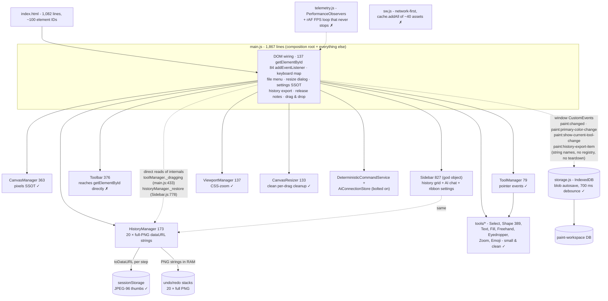
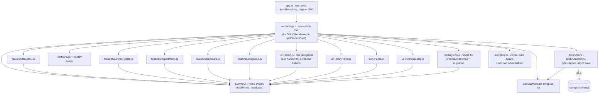
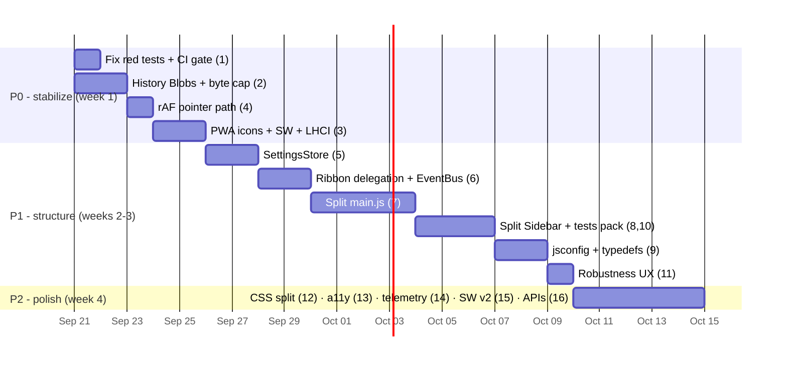

# Paint - Technical Audit & Improvement Plan

> **Audit date:** 2026-09-19 · **App:** `paint/` (Paint Online, v1.5.0 in `package.json`)
> **Scope:** the `paint/` app only (~8,800 LOC). `diff/`, `notepad/`, `litellm/` are separate apps in the workspace and were **not** audited.
> **Tone:** no sugar, a little salty. Every claim below points to a real file/line so you can verify it yourself.
> **Companion:** interactive version at [`audit-report.html`](audit-report.html) (mermaid graphs + sortable tables).

---

## 1. Executive summary

Paint Online is a **structurally better-than-average vanilla JS app** with a genuinely good canvas core (image-pixel SSOT, overlay separation, snapshot-on-stroke-end, an OOM guard on shape measurement). The `.skills/` + `AGENTS.md` contract is a best practice most projects don't have.

But the app is being **held together by a 1,867-line `main.js`** that owns 137 `getElementById` calls and 84 event listeners, a **history system that stores 20 full-resolution PNG strings in RAM**, a **test suite that is currently RED (39/41 passing)** with brittle grep-tests, and a **PWA manifest that cannot pass Lighthouse installability** (SVG-only icon). None of these are hard to fix. All of them block the two goals you stated: high Lighthouse scores for the coming domain launch, and safe future expansion.

### Headline problems (the salt)

| # | Problem | Evidence | Why it hurts |
|---|---------|----------|--------------|
| 1 | Test suite is **red right now** - 2 failures | `node --test`: 41 tests, 39 pass, **2 fail**; smoke.test.js:303 expects missing `docs/COMMUNITY_STANDARDS.md`; smoke.test.js:395 expects `height: min(560px, 88vh)` while `css/styles.css:1695` says `440px` | `npm test` is your only gate (`validation.md` step 2). A red gate = no gate. |
| 2 | **God file** | `js/main.js` = 1,867 lines, 137× `document.getElementById`, 84× `addEventListener` | Violates your own `.skills/architecture.md` ("main.js as composition root"). Every new feature raises the blast radius. |
| 3 | **History eats RAM** | `js/history/HistoryManager.js:6` `MAX_HISTORY = 20`, each entry a full `canvas.toDataURL('image/png')` string (line 57) | 20 × ~2–30 MB strings on a 2000px canvas. On a 6000×6000 canvas this is an out-of-memory crash, not a slowdown. |
| 4 | **PWA icon gap** | `manifest.json:11-18` - single `icon.svg`, `sizes:"any"` | Lighthouse PWA requires a 192px and 512px PNG (maskable). Installability + Lighthouse score lost before you even buy the domain. |
| 5 | **Untyped JS with hidden contracts** | No `jsconfig.json`; `ToolManager._handle` passes `ctx` bag; `main.js:433` reads `toolManager._dragging` from outside | The nastiest bugs you already fixed (phantom selection, `_pendingToolRestore`) are exactly the class TypeScript/JSDoc types catch at edit time. |

### Headline strengths (the sugar you earned)

- **Coordinate model is right**: drawing happens in true image pixels, zoom is a CSS transform (`js/canvas/ViewportManager.js:119-126`) - crisp at any zoom, no re-raster.
- **Overlay vs. pixels separation** (`CanvasManager.js:1-6`): selection/UI never contaminates the saved image.
- **Snapshot on stroke-end, not mousemove** (`HistoryManager.js:2-4`) + **no-change snapshot skip** via pixel signature (`CanvasManager.js:56-71`).
- **Bounded memory thinking already exists**: `MAX_MEASURE_PIXELS` guard (`CanvasManager.js:10-13`), 96px JPEG session thumbs (`HistoryManager.js:142-151`), debounced IDB blob autosave (`js/storage.js:67-78`).
- **The agent contract** (`.skills/*.md`, `AGENTS.md`, `CONTRIBUTING.md`, `SECURITY.md`, PR template) is genuinely good and enforced by tests.
- **No native `alert/confirm/prompt`** - a real dialog service (`js/ui/DialogService.js`), per your own rules.

---

## 2. How this was measured (methodology)

| Method | Command / technique | Result |
|--------|--------------------|--------|
| Listener census | `grep -rc addEventListener paint/js` | **176 total**. Top: `main.js` 84, `ui/Sidebar.js` 26, `ui/Toolbar.js` 22, `ui/PanelLayoutManager.js` 6, `tools/ToolManager.js` 6 |
| Cleanup census | `grep -rn removeEventListener paint/js` | Only 21 hits, concentrated in drag-cleanup paths (`CanvasResizer.js:83-93`, `PanelLayoutManager.js:88-93`, `storage.js:74-77`) - i.e. most "global" listeners (window `paint:*` events, keyboard, drop, telemetry rAF) have **no teardown path at all** |
| Hot-path search | `toDataURL | getImageData | innerHTML | localStorage` | `toDataURL(PNG)` in HistoryManager on snapshot/undo/redo/getSessionEntries; `getImageData` full row-scan in `CanvasManager._alphaBounds:326-350`; 27× `innerHTML=` (audited: all static strings, no user-controlled XSS found) |
| DOM coupling | `grep -c document.getElementById` | `main.js` **137**, `ui/Toolbar.js` **18**, `ui/Sidebar.js` **27** |
| Size map | `wc -l` | `main.js` 1867, `ui/Sidebar.js` 827, `css/styles.css` 2344, `ui/Toolbar.js` 376, `tools/ShapeTool.js` 389 - vs. healthy modules: `ToolManager` 79, `ViewportManager` 137, `DialogService` 64 |
| Test run | `npm test` (node --test) | **41 tests, 39 pass, 2 fail** (see §10 for exact fixes) |
| Contract audit | read `.skills/*.md`, `AGENTS.md`, `sw.js`, `manifest.json`, `robots.txt`, `sitemap.xml`, `tests/*` | See §4 area I and §9 |
| Lighthouse | not yet run - no `lhci` in CI (`.gitlab-ci.yml` only for notepad) | P0 gap; pre-flight checklist in §9 |

**What could NOT be measured here (be honest):** real Lighthouse/CrUX scores, FPS under load, Safari/Firefox behavior, touch-input ergonomics. §9's checklist tells you exactly how to capture those before the domain launch.

---

## 3. Architecture

### 3.1 As-is (what the code actually does today)



**Three structural smells visible in one picture:**
1. `main.js` is simultaneously composition root, keyboard handler, file menu, settings store, export pipeline, and drag-drop controller.
2. Cross-module communication is split between *callbacks* (`onChange`, `onToolChange` - good) and *raw window string events with no registry* - plus **direct reads of other modules' private fields** (`toolManager._dragging` at `main.js:433`, `historyManager._restore` called from `Sidebar.js:778`).
3. `Sidebar.js` is a second god object (history + AI + ribbon-settings in one class).

### 3.2 Target (what to build toward)



Rules for the target (already written down by you - this audit just enforces them):
- Only the composition root touches `document.getElementById`. Everything else receives refs via constructor.
- All `paint:*` window events go through `EventBus` with a **declared, typed name list** (SSOT for event names).
- One module = one reason to change. `Sidebar.js` splits into HistoryPanel / AiPanel / SettingsDialog.
- Modules expose `destroy()`/`off()` so listeners can be cleaned (needed for tests and future multi-document).

---

## 4. Scorecard - ranked

Grade scale: 10 = Lighthouse-ready, production-clean. Ranking = best → worst.

| Rank | Area | Score | One-line verdict | Key evidence |
|------|------|-------|------------------|--------------|
| 1 | Runtime performance (draw path) | **7/10** | Right architecture; small leaks remain | snapshot-on-stroke-end; CSS zoom; but `ToolManager.js:27,44` two `pointermove` listeners, no rAF batching, `getBoundingClientRect` per event (`ViewportManager.js:130`) |
| 2 | UI & CSS quality | **6.5/10** | Strong tokens/dark-mode; monolithic file | `styles.css` 2,344 lines + `progressive.css`; ribbon hides its horizontal overflow from keyboard users (`styles.css:66-71`) |
| 3 | SEO / PWA / Lighthouse readiness | **6/10** | Metadata excellent; PWA & perf budget gaps | canonical+OG+Twitter+JSON-LD+robots+sitemap aligned ✓; `manifest.json` SVG-only icon ✗; `sw.js:45-47` `cache.addAll` all-or-nothing ✗ |
| 4 | Memory / OOM safety | **5.5/10** | Good guards in one place, unbounded in another | `MAX_MEASURE_PIXELS` ✓ vs. 20 uncapped-byte PNG history entries + no canvas-size cap ✗ |
| 5 | Structure & modularity | **5.5/10** | Good leaves, bad trunks | 30 modules with clean roles, but `main.js` 1867 + `Sidebar.js` 827 |
| 6 | Robustness & edge cases | **5/10** | Good try/catch hygiene; missing failure UX | quota-exceeded has no user-facing path; IDB corruption not recovered; SW install fails atomically |
| 7 | Clean code / SSOT / DRY | **5/10** | Contract is great; violations live in main.js | storage keys in ≥7 files; settings mirrored in `saveSettings`/`readSettings`/`getHistoryPrefs`/`syncHistoryControls` (main.js:974-1054); version drift: package 1.5.0 vs sw cache `paint-shell-v1-6-3` |
| 8 | Expandability / onboarding | **5/10** | `.skills/` contract excellent; entry cost too high | adding one tool requires reading main.js; AI modules bolted on; no plugin API |
| 9 | Event-listener hygiene | **4.5/10** | 176 listeners, 4 teardown paths | per-button binding instead of delegation (`Toolbar.js:355-370`); dual `pointermove` (ToolManager.js:27,44); zero `passive` flags on scroll-class listeners; window `paint:*` listeners with no `off` |
| 10 | Accessibility | **4/10** | Partial labels; keyboard gaps | history tiles are clickable ``+`<div>` not buttons (Sidebar.js:762-803); ribbon drag handle `⠿` has no keyboard equivalent; no focus-trap in dialog |
| 11 | Tests & coverage | **3/10** | Suite red; right idea, wrong medium | 2 files only; `smoke.test.js` asserts on regex over source text; 2 tests failing today |
| 12 | TypeScript readiness | **2/10** | Nothing typed, contracts implicit | no tsconfig/jsconfig; `pt {x,y,button}`, `entry {dataUrl,width,height}`, `toolContext` bag all untyped |

---

## 5. Detailed findings & fixes

### A. Runtime performance - 7/10

**Good:** snapshot-on-stroke-end (not per-move); zoom as CSS transform so drawing is never re-rasterized; `willReadFrequently` on both read contexts (`CanvasManager.js:31,62,302`); IDB autosave debounced 700 ms.

**Bad, with receipts:**

1. **Two `pointermove` listeners on the same surface** - `ToolManager.js:27` (`_handle('onMove')`) and `ToolManager.js:44` (`_reportPosition`). Every mouse move runs tool logic *and* status-bar update *and* `clientToImage()` → `getBoundingClientRect()` (a forced layout read) twice.
   **Fix:** one listener, one rAF-batched pipeline (no `preventDefault` needed on move → `passive:true`), and cache the canvas `rect` on `pointerdown`/zoom/scroll instead of per-event `getBoundingClientRect` (`ViewportManager.js:130`).
   **Impact:** High (INP, battery, touch latency) · **Effort:** S (one file, ~30 lines).

2. **`button.innerHTML` DOM churn in status paths** - `main.js:100` rebuilds the color-inspector toggle SVG on every collapse/expand; same pattern in `Toolbar.js:59,109,213`. **Fix:** pre-render both icons once, toggle `hidden`. **Impact:** Low · **Effort:** S.

3. **`telemetry.js` rAF loop never stops** (`telemetry.js:29-50`) - burns battery on idle tabs and pollutes your own FPS metric. **Fix:** pause on `visibilitychange`, add `destroy()`. **Impact:** M · **Effort:** S.

### B. Event-listener hygiene - 4.5/10

**The numbers:** 176 `addEventListener`, only 21 `removeEventListener`, and those 21 cover just drag-cleanup and the autosave uninstall. Everything attached to `window`/`document` at module scope lives forever.

1. **Per-button binding instead of delegation** - `Toolbar.js:355-370` does `document.getElementById('btn-new').addEventListener('click', …)` ×11; `main.js` does the same for ~84 controls.
   **Fix (delegation, one handler for the whole ribbon):**
   ```html
   <button type="button" class="rbtn" id="btn-new" data-action="newFile">…</button>
   ```
   ```js
   // ui/Ribbon.js - ONE listener for ALL ribbon buttons
   ribbonEl.addEventListener('click', (e) => {
     const btn = e.target.closest('[data-action]');
     if (!btn || btn.disabled) return;
     this.handlers[btn.dataset.action]?.(btn.dataset);
   });
   ```
   `index.html` gains `data-action` attributes; `Toolbar._bindFileButtons` shrinks to zero.
   **Impact:** High (leak surface, readability, testability) · **Effort:** M.

2. **Window listeners added per drag** - `main.js:246-248,749-752` add `pointermove`/`pointerup` on `window` during drags. Correctly removed *today*, but this is exactly the pattern behind the notepad project's `KeyboardShortcuts.js:112` bug (removing with a *fresh* closure = never removes). **Fix:** standardize on the `CanvasResizer.js:83-95` cleanup pattern, or use `setPointerCapture` so window listeners aren't needed at all. **Impact:** M · **Effort:** S.

3. **`paint:*` string events with no registry** - `paint:changed`, `paint:primary-color-change`, `paint:show-current-tool-change`, `paint:history-export-item`, `paint:ready` are raw strings dispatched on `window` from ≥4 files. A typo compiles fine and silently breaks. **Fix:** `js/core/EventBus.js` with a frozen name list; new rule file `.skills/event-hygiene.md` (drafted in this audit). **Impact:** M · **Effort:** S.

4. **`passive` flags** - the only flags used are `{passive:false}` (correct where `preventDefault` is needed, e.g. `ViewportManager.js:56-65`). Move-status tracking that never calls `preventDefault` should be `{passive:true}`. **Impact:** S · **Effort:** S.

### C. Memory / OOM safety - 5.5/10

**Good:** `MAX_MEASURE_PIXELS = 16M px (~64 MB)` cap with retry-downgrade (`CanvasManager.js:10-13,274-284`) - genuinely thoughtful, and the only place thinking in pixel budgets. Session backup uses 96px JPEG thumbs (`HistoryManager.js:142-151`) to respect the ~5 MB `sessionStorage` quota.

**Bad, with receipts:**

1. **Undo history = 20 full-resolution PNG strings in RAM.** `HistoryManager.js:6,57,59` - `toDataURL('image/png')` per snapshot. A 2000×2000 canvas PNG is typically 1–8 MB *as a base64 string* (+33% inflation); 20 entries plus the "Current" entry that `getSessionEntries()` re-encodes **every time the history panel opens** (`HistoryManager.js:125-130`) can reach ~150 MB. On a 6000×6000 canvas (144 Mpx) a single snapshot is ~50–200 MB - the app OOM-crashes before the measurement guard ever matters.
   **Fix:** store **Blobs capped by bytes, not count**:
   ```js
   const MAX_HISTORY_BYTES = 48 * 1024 * 1024;
   snapshot() {
     this.canvas.toBlob((blob) => {
       if (!blob) return;
       this.undoStack.push({ blob, width, height });
       while (byteSum(this.undoStack) > MAX_HISTORY_BYTES) this.undoStack.shift();
       this._notify();
     }, 'image/png');
   }
   ```
   Display via `URL.createObjectURL(blob)` + `revokeObjectURL` on evict/`clear()`. `getSessionEntries()` reuses the last entry instead of re-encoding the live canvas.
   **Impact:** Critical (prevents hard crash) · **Effort:** M (HistoryManager + Sidebar grid + export paths).

2. **No canvas-size cap on open/import/paste/drop** (`main.js:1855-1865`, ClipboardManager) - a 12000×9000 photo = 108 Mpx canvas ≈ 430 MB RGBA before history. **Fix:** clamp imports to a max dimension (e.g. 4096 px) with a status-bar flash - same spirit as `MAX_MEASURE_PIXELS`. **Impact:** High · **Effort:** S.

3. **Double encode on every undo/redo** (`HistoryManager.js:69-78`): `toDataURL` for current state, then `_restore` decodes it again. With Blobs this becomes `createImageBitmap` (async) - also removes the main-thread freeze when restoring big canvases. **Impact:** M · **Effort:** included in the Blob refactor.

<!-- CHUNK-3C -->

### D. Structure & modularity - 5.5/10

**Good:** the `canvas/ tools/ history/ ui/ settings/ utils/` split is right; the small modules (`ToolManager` 79, `ViewportManager` 137, `DialogService` 64, `storage.js` 78) are models of what the rest should look like.

**Bad:**
1. `main.js` (1,867) = composition root + keyboard manager + file menu + resize dialog + settings store + export pipeline + release notes + drag-drop. Its *own* section headers (`// ---------- History preferences + export helpers ----------`, main.js:1013) admit it.
2. `Sidebar.js` (827) is three features in one class: History grid (IndexedDB), Session grid, AI chat + connection store, ribbon/group settings. It also calls `historyManager._restore(entry)` directly (`Sidebar.js:778`) - reaching into a private method of another module.
3. `Toolbar.js` reads buttons via `document.getElementById` inside a UI class (`Toolbar.js:355-370`) instead of receiving them - untestable outside a full DOM.
   **Fix:** see target graph §3.2. Extract in this order: `SettingsStore` → `HistoryPanel` → `AiPanel` → `keyboard.js` → `fileMenu.js`. Delete `_`-private access; expose `historyManager.restore(entry)` as a public API.
   **Impact:** High (all future velocity) · **Effort:** L (but split into 5 safe M-sized PRs).

### E. Clean code / SSOT / DRY - 5/10

Your `.skills/coding.md` says: "defaults, labels, storage keys, and command definitions belong in one place." Reality:

| Key | Defined in |
|-----|-----------|
| `omerpaint:last-canvas` | `CanvasManager.js:8` |
| `paint:session-backup` | `HistoryManager.js:7` |
| `omerpaint:settings` | `main.js:882` |
| `paint:zoom` / `paint:initial-zoom` | `ViewportManager.js:19-20` |
| `paint:selected-shape` / `paint:shape-select-after-draw` / `paint:tool-styles` / `paint:style-history` / `paint:show-current-tool` | `Toolbar.js:4-7,49` |
| app version | `package.json` 1.5.0 vs `sw.js:1` `paint-shell-v1-6-3` (sync script exists: `scripts/sync-version.mjs` - verify it runs on release) |

**Settings logic is quadruplicated:** `saveSettings()` (main.js:978-1011), `readSettings()` (974-976), `getHistoryPrefs()` (1014-1020), `syncHistoryControls()` (1040-1054) each re-implement the same defaults (`historyAutoSave !== false`, mode `'lifecycle'`). One bad merge and two UI mirrors disagree.
**Fix:** `settings/SettingsStore.js` - one `get(key)`, one `set(patch)` (persist + emit), defaults declared once. `getHistoryPrefs()` becomes `settings.get('historyAutoSave')`.
**Impact:** High (bug prevention, not style) · **Effort:** M.

### F. TypeScript readiness - 2/10

No `tsconfig.json`/`jsconfig.json`, no `// @ts-check`, types exist only in some JSDoc comments. The app's hardest bugs were type-shaped: the "phantom selection" bug (smoke.test.js:432-440 documents it), `floatingCanvas` lifecycle, `_pendingToolRestore`. Types would have flagged each one.
**Fix - three steps, no rewrite:**
1. `jsconfig.json` with `"checkJs": true, "strict": false` in the IDE - instant editor feedback, zero runtime change.
2. `js/types.d.ts` + JSDoc on the 5 core contracts:
   ```js
   /** @typedef {{x: number, y: number, button: number}} Pt */
   /** @typedef {{x: number, y: number, w: number, h: number}} Region */
   /** @typedef {{name: string, cursor?: string, onDown?, onMove?, onUp?, onActivate?, onDeactivate?}} Tool */
   /** @typedef {{blob: Blob, width: number, height: number}} HistoryEntry */
   /** @typedef {{canvasManager: CanvasManager, historyManager: HistoryManager, setSelection: (r: Region|null) => void, getSelection: () => Region|null, …}} ToolContext */
   ```
3. Gradually add `"strict": true`. Migrate leaf-pure modules (`utils/color.js`, `utils/transform.js`) to `.ts` first if you ever adopt a build step.
**Impact:** High (kills an entire bug class before the AI/plugin features grow) · **Effort:** M (1 day for step 1+2 across ~30 files of headers).

### G. Tests & coverage - 3/10

**Current state: 41 tests, 39 pass, 2 fail (`npm test` today).**

- `tests/shape-layer.test.js` - the **good one**: drives real `CanvasManager`/`ShapeTool` code against a fake 2D context, tests behaviour (clipped-ink re-measure, OOM bound, click fallback). Keep and extend this style.
- `tests/smoke.test.js` (~23 KB) - mostly **regex-over-source-text** assertions:
  ```js
  assert.match(main, /beforeunload'[\s\S]{0,400}?commitFloatingSelection\(\)/);   // tests:404-441
  assert.match(css, /height:\s*min\(560px,\s*88vh\)/);                            // ← this one is FAILING right now
  ```
  These tests break when you reformat or rename - not when behaviour breaks - and they give **zero behavioural coverage** of drawing, undo, or save.
- **Missing entirely:** HistoryManager tests (undo/redo/byte-cap/quota), ToolManager gesture tests (pending-restore, no phantom drag), storage.js tests, any DOM test, any e2e, coverage measurement, CI for paint (`.gitlab-ci.yml` exists in `notepad/`, **nothing for `paint/`**).

**Fix:**
1. Make the suite green (exact fixes in §10).
2. Port each grep-test to a behavioural test of the extracted module (possible only after §D refactor - another reason to do it).
3. Add `tests/history.test.js`, `tests/toolmanager.test.js`, `tests/storage.test.js` (fake `indexedDB`), `tests/app.dom.test.js` (happy-dom/jsdom) for Ribbon delegation.
4. Add coverage: `node --test --experimental-test-coverage` (zero new deps) and a target: **≥70% lines on `js/canvas`, `js/tools`, `js/history`, `js/clipboard`**.
5. Add CI (GitHub Actions) running `node --check` on all JS + `npm test` + Lighthouse CI (§9).
**Impact:** High · **Effort:** M, and it must come *after* the §D split or you'll test the god file's strings again.

<!-- CHUNK-3D -->


### H. UI & CSS - 6.5/10

**Good:** design tokens in `:root` with a full dark-mode override (`styles.css:3-34`); flex/grid layout with min/max constraints; `.rbtn` component reused everywhere; `progressive.css` handles responsive degradation separately.

**Bad:**
1. **`styles.css` is 2,344 lines** covering ribbon + canvas + dialogs + settings + sidebar + color inspector in one file. **Fix:** split by component with `@layer` for cascade order: `tokens.css, ribbon.css, canvas.css, sidebar.css, dialog.css, settings.css`. Mechanical, zero-risk if done as pure cut/paste. **Impact:** M · **Effort:** M.
2. **Ribbon horizontal overflow is keyboard-invisible** - `overflow-x:auto` + `scrollbar-width:none` + `::-webkit-scrollbar{display:none}` (`styles.css:66-77`): narrow screens get a scrollable ribbon users can't discover or wheel-scroll. **Fix:** on narrow widths show an edge-fade gradient or collapse into the existing overflow `…` menu. **Impact:** M (UX + a11y) · **Effort:** S.
3. **No focus-visible system** - many controls rely on `title` tooltips; the dialog has no focus trap or restore. See K.
4. **`user-scalable=no`** (`index.html:6`) - defensible for a canvas app (stops pinch-zoom fighting gestures) but caps the a11y score for low-vision users. Decide deliberately and document the trade-off. **Impact:** S · **Effort:** S (a decision, not code).

### I. SEO / PWA / Lighthouse readiness - 6/10

**Good:** canonical, OG, Twitter card, JSON-LD `WebApplication`, `robots.txt`, `sitemap.xml`, verification meta - present and mutually consistent (`index.html:8-63`). `og:image` → `css/assets/preview.png` **exists (97 KB)** ✓.

**Bad (each is a concrete Lighthouse point loss):**
1. **PWA installability fails today**: `manifest.json:11-18` declares a single SVG icon. Chrome/Lighthouse require **192×192 and 512×512 PNG** (maskable recommended). Your `icon.svg` is 875 bytes - a 5-minute export fixes a whole category. **Impact:** High · **Effort:** S.
2. **`sw.js` install is all-or-nothing**: `cache.addAll(SHELL)` with ~40 URLs (`sw.js:45-47`) - one 404 and offline support *silently never installs*. The SHELL list is also a manual SSOT (every new module must be remembered).
   ```js
   self.addEventListener('install', (event) => {
     event.waitUntil((async () => {
       const cache = await caches.open(CACHE_NAME);
       await Promise.allSettled(SHELL.map((url) => cache.add(url))); // never fails wholesale
       await self.skipWaiting();
     })());
   });
   ```
   Long-term: generate the asset list at build time (`glob js/**/*.js`) so it can't drift. **Impact:** M–H · **Effort:** S.
3. **Network-first SW** (`sw.js:55-66`) re-fetches everything on reload - fine for freshness; **stale-while-revalidate** for static assets is a free repeat-view win. **Impact:** M · **Effort:** S.
4. **No Lighthouse CI anywhere** (notepad has `.gitlab-ci.yml`; paint has nothing). Until measured, "high score" is a hope - see §9. **Impact:** High · **Effort:** S.

### J. Robustness & edge cases - 5/10

**Good:** storage touches are `try/catch`ed; floating selection committed on `beforeunload`/`pagehide`; paste uses the native event for Safari (`main.js:1824-1832`); drag-drop validates `file.type`; `_pixelsSignature` degrades gracefully when reads are blocked (`CanvasManager.js:56-71`).

**Bad:**
1. **Quota exceeded = silent data loss.** `saveCanvasState` catches and `console.warn`s (`storage.js:42-45`) while the user keeps drawing believing autosave works. **Fix:** emit `paint:storage-error` → status flash + one-time dialog with "Download now". **Impact:** High (user trust) · **Effort:** S.
2. **Corrupt IndexedDB = dead autosave forever.** `openDatabase` has no recovery (`storage.js:5-16`). **Fix:** on open error, offer "Reset local storage" (delete DB, reopen) - ~20 lines. **Impact:** M · **Effort:** S.
3. **SW atomic-install failure** (I-2): a user who once got a broken install keeps it until the cache name bumps.
4. **History render race** - `Sidebar.init` has `_initPromise` guards (`Sidebar.js:44-56`) but `refreshHistory()` can still interleave with tab switches (`Sidebar.js:681-689`); the `_loadHistoryWithRetry` loop hints at a real past race. After the HistoryPanel split, make each view single-flight. **Impact:** M · **Effort:** S.

### K. Accessibility - 4/10

1. History tiles are clickable `` + `<div>` (`Sidebar.js:762-803`) - not keyboard reachable as a unit. **Fix:** tile = `<button class="history-item" aria-label="…">` with an actions row. **Impact:** M · **Effort:** M.
2. Ribbon drag handle `⠿` (`index.html:71`) is mouse-only. **Fix:** arrow-key nudge when focused, or demote to a settings toggle. **Impact:** M · **Effort:** S–M.
3. `DialogService.js` - native `<dialog>` gives some focus handling for free, but add focus restore to the previously-focused element on close. **Impact:** M · **Effort:** S.
4. **Wins to keep:** `aria-label`s on all selection handles (`index.html:728-743`), `aria-expanded` on the inspector toggle, semantic `<header>/<main>`, visible `:focus-visible` states exist in places.

### L. Expandability & onboarding - 5/10

**Good:** `AGENTS.md` + `.skills/` is a real onboarding contract; `CONTRIBUTING.md`, `SECURITY.md`, PR template exist - rare for a small app.
**Bad:** adding one tool = read `main.js` to learn the `toolContext` bag; adding one setting = touch ~5 places (`main.js` registry, `index.html`, `saveSettings`, `syncHistoryControls`, maybe Sidebar).
**Fix:** after the §3.2 refactor, define two extension APIs:
```js
// registering a tool - one file, no main.js edit
toolManager.register(createMarkerTool({ canvasManager, history, bus }));
// registering a persisted setting - one entry drives dialog + sync + persistence
SettingsStore.define({
  key: 'grid.show', default: false,
  ui: { control: 'checkbox', label: 'Show grid', section: 'Canvas' },
});
```
**Impact:** High for your "expand in the future" goal · **Effort:** M (after §D).

---

## 6. Prioritized improvement backlog

Impact: 🔴 critical · 🟠 high · 🟡 medium · ⚪ low. Effort: S < half day · M = 1–3 days · L = a week+.

| # | Priority | Improvement | Area | Impact | Effort | Why (one line) |
|---|----------|-------------|------|--------|--------|----------------|
| 1 | P0 | Fix the 2 failing tests + make `npm test` a hard gate in CI | G | 🔴 | S | A red gate means every other guarantee on this page is unchecked |
| 2 | P0 | History → Blobs, byte-capped; kill re-encode in `getSessionEntries` | C | 🔴 | M | Prevents OOM crash = your explicit "must not crash" requirement |
| 3 | P0 | PWA icons 192/512 PNG + `Promise.allSettled` SW install + Lighthouse CI budgets | I | 🟠 | S–M | Everything else is pointless if the domain launch scores poorly |
| 4 | P0 | rAF-coalesce pointer path + cached rect | A | 🟠 | S | Cheapest measurable INP/FPS win |
| 5 | P1 | Extract `SettingsStore` (SSOT for settings + keys) | E | 🟠 | M | Kills the 4-way settings duplication and the mirrored-control bug class |
| 6 | P1 | Ribbon `data-action` delegation + EventBus with typed names | B | 🟠 | M | 176 listeners → ~40; leaks become impossible |
| 7 | P1 | Split `main.js` into `features/*` (keyboard, fileMenu, resize, export, dragDrop) | D | 🟠 | L | Unblocks every future feature; makes grep-tests replaceable by real tests |
| 8 | P1 | Split `Sidebar.js` → HistoryPanel / AiPanel / SettingsDialog; public `restore()` API | D | 🟠 | M | Second god object; also removes `_restore` privacy violation |
| 9 | P1 | `jsconfig` + `checkJs` + typedefs for the 5 core contracts | F | 🟠 | M | Type-shaped bugs (phantom selection) get caught at edit time |
| 10 | P1 | Behavioural test pack: history, tool gestures, storage, DOM smoke via happy-dom | G | 🟠 | M | Real coverage of the code that exists, not of its source text |
| 11 | P1 | Quota-exceeded + corrupt-IDB recovery UX; import size clamp 4096px | J | 🟠 | S | "No data loss" promise, currently enforced by luck |
| 12 | P2 | Split `styles.css` by component + `@layer` | H | 🟡 | M | 2,344 lines → 6 files a new dev can navigate |
| 13 | P2 | A11y pass: history tile buttons, dialog focus restore, ribbon keyboard overflow | K | 🟡 | M | Lighthouse a11y + real users on keyboards/screen readers |
| 14 | P2 | Telemetry visible-state pause + `destroy()` | A | 🟡 | S | Battery + honest FPS numbers |
| 15 | P2 | Stale-while-revalidate for static assets; build-time SW asset list | I | 🟡 | S | Repeat-view speed, no more manual SHELL |
| 16 | P2 | Tool/setting registration APIs | L | 🟡 | M | "Expandable" becomes a property, not an intention |

## 7. Suggested execution order (4 phases)



Rule of thumb applied: **crash-safety before speed, speed before beauty, beauty before convenience-APIs.**

<!-- CHUNK-4B -->

