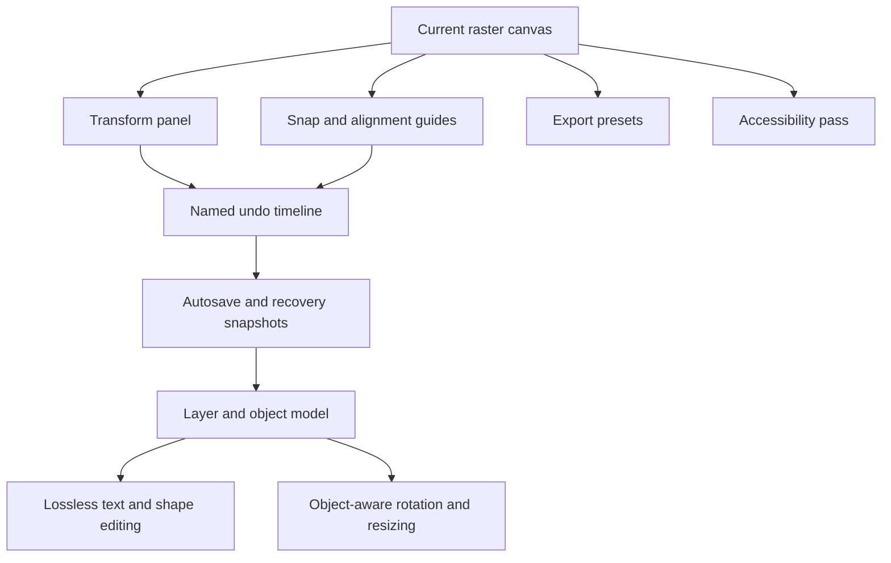

# Paint: next improvement roadmap

This roadmap focuses on improvements that would give the app the most value for
the least complexity. Ratings use **1–5**, where 5 is highest.

| Priority | Improvement | Example user problem | What it solves | Impact | Effort |
|---|---|---|---|---:|---:|
| 1 | Layers and non-destructive objects | A rotated rectangle must be redrawn to change its color or angle | Shapes and text remain editable after creation; rotation and resizing stay lossless | 5 | 5 |
| 2 | Multi-step undo timeline | A user cannot remember which edit caused a bad result | Shows named actions and lets users jump back to a known state | 5 | 3 |
| 3 | Snap, guides, and alignment | Two shapes look almost aligned but are a few pixels apart | Makes diagrams, arrows, and UI mockups look precise | 4 | 3 |
| 4 | Export presets | Users repeatedly choose PNG settings and dimensions manually | One-click PNG, JPEG, transparent PNG, and clipboard-ready exports | 4 | 2 |
| 5 | Selection transform panel | Precise rotation and sizing by pointer can be difficult | Adds numeric X/Y/W/H and angle controls beside the selection | 4 | 3 |
| 6 | Recent tools, shapes, and styles | Users repeatedly reopen menus for the same combinations | Makes the remembered tool/shape/style workflow immediately accessible | 3 | 2 |
| 7 | Accessibility pass | Keyboard and screen-reader users cannot identify every visual state | Adds focus states, announcements, keyboard navigation, and contrast checks | 4 | 2 |
| 8 | Project recovery and autosave snapshots | A tab closes before the latest edit is saved | Restores the latest recoverable session without replacing intentional history | 5 | 3 |

## Recommended sequence

Start with the transform panel and snap/alignment tools because they improve the
current raster workflow immediately. Then add layers/objects as the larger
architecture change. The existing toolbar memories and history provide a good
foundation for recent-item shortcuts and recovery snapshots.



## Example: object-aware rotation

Today, a selected canvas region is rotated as pixels. A future object model
could store a rectangle as:

```js
{
  type: 'rectangle',
  x: 120,
  y: 80,
  width: 240,
  height: 140,
  rotation: 18,
  stroke: '#a349a4',
  strokeWidth: 3,
  fill: 'none'
}
```

Changing `rotation`, color, or size would redraw the object from its original
parameters. This prevents repeated raster resampling and makes the selection
box naturally follow the shape.

## Example: transform panel

| Control | Example | Benefit |
|---|---:|---|
| X / Y | `120 / 80 px` | Repeatable placement |
| Width / Height | `240 / 140 px` | Exact proportions |
| Rotation | `18°` | Precise angle without pointer drift |
| Lock ratio | On | Prevents accidental distortion |
| Apply / Reset | Buttons | Clear, reversible transform workflow |
