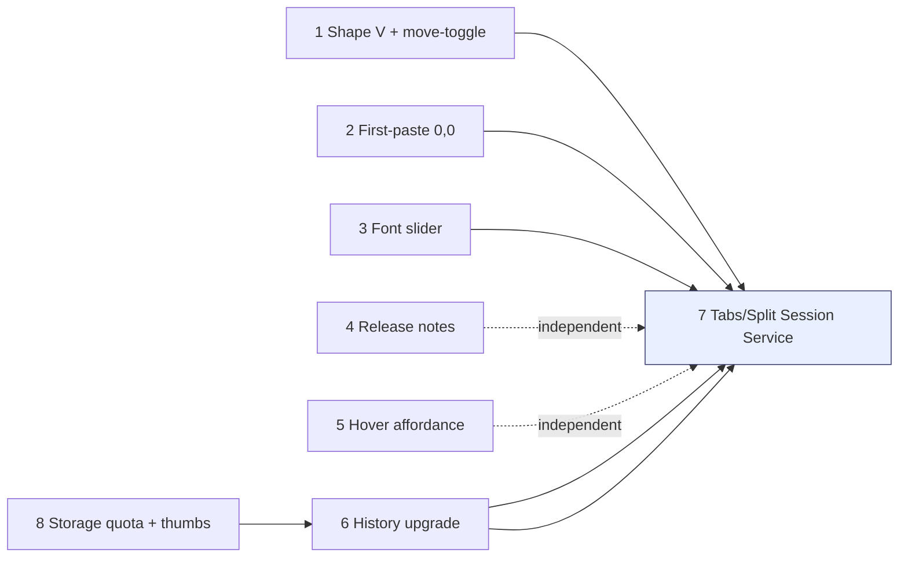
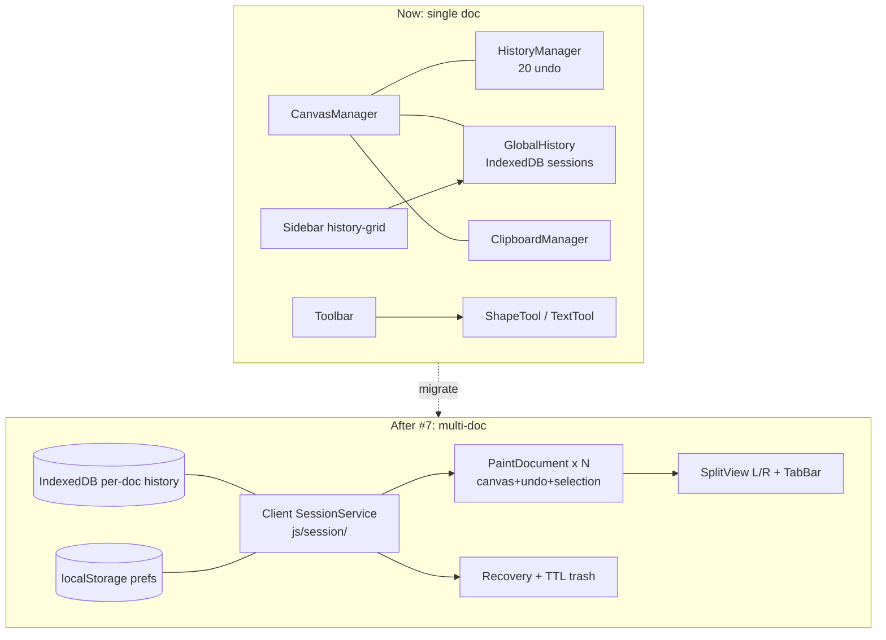

# Paint — Plan Overview (concise)

> Review this first. Details in `PLAN-DETAILS.md`. No code changed yet.

## Scope map (8 requests)

| # | Title | Files touched | Effort | Risk |
|---|---|---|---|---|
| 1 | V-shape anchor fix + “create then move/select” toggle in Shapes More | `js/tools/ShapeTool.js`, `js/tools/SelectTool.js`, `js/ui/Toolbar.js`, `index.html`, `css/styles.css` | S-M | Low |
| 2 | First-paste on fresh New goes to 0,0 | `js/clipboard/ClipboardManager.js`, `js/main.js` | S | Low |
| 3 | Font-size slider 1–120 above box options | `index.html`, `js/ui/Toolbar.js`, `css/styles.css` | S | Low |
| 4 | Settings → Release Notes tab | `index.html`, `js/main.js`, `js/version.js`, `docs/` | S | Low |
| 5 | `tool-status-btn inactive-status` hover affordance | `css/styles.css` (+title in `Toolbar.js`) | XS | None |
| 6 | History: skip no-change saves; History/Session tabs; responsive 2-col; colored buttons | `js/history/*`, `js/ui/Sidebar.js`, `index.html`, `css/styles.css`, `js/canvas/CanvasManager.js` | M | Med (storage) |
| 7 | Tabs (≤10) + split view + session service + recovery [BIG] | NEW `js/session/*`, `js/ui/*` (tabs, split), `index.html`, `css/*`, `js/storage.js` | XL | High — do last |
| 8 | Stored-data quota + compressed history thumbs | `js/history/GlobalHistory.js`, `js/main.js` (About), `js/ui/Sidebar.js` | M | Med |

## Dependency / order

## Architecture impact

## Decisions for you (review)

1. #1 default for “select-after-draw”: OFF (opt-in in More) or ON? Plan default **OFF** to avoid surprising existing users.
2. #6 Session tab = in-memory `HistoryManager.undoStack+redoStack` (lost on reload) — correct? Plan: yes, History=IndexedDB persistent, Session=volatile.
3. #7 limit 10 tabs total across both panes (not 10/pane)? Plan: **10 total**, min 1 always open.
4. #8 thumbnails: WebP/JPEG q0.6 ~96px for grid, full PNG only on load? Plan: yes, with fallback to full if decode fails.

## Proposed phases

* **P0 quick wins (1–2 days):** #5, #3, #2, #4, #1.
* **P1 history+storage (2–4 days):** #8 spike (measure quota) → #6.
* **P2 tabs/split (1–2 weeks):** #7 — needs new `js/session/` service, `TabBar` + `SplitView` UI, per-tab storage keys, recovery. Do after P0/P1 stable.
* Skills (`.skills/session-storage`, `.skills/split-view`): write during P2 from MDN + split-pane a11y research, not before.
