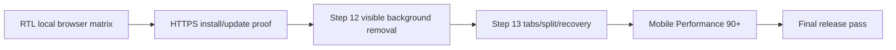

# Phase 2 continuation plan status — 2026-09-21

This is the working status for the remaining launch and feature milestones.
The numbered Phase 2 status files remain historical evidence; this document is
the short execution queue.

## Current status

| Priority | Work | Status | Evidence / dependency |
| --- | --- | --- | --- |
| 1 | RTL browser validation | **Local Chrome matrix complete** | LTR/RTL desktop, narrow 375×812, and 200%-zoom layout emulation pass for menus, submenus, shape gallery, and reachable canvas handles. Real-device matrix remains open. |
| 2 | HTTPS install/update/offline proof | **Open** | Requires deployment URL/hosting access and an updateable HTTPS build. |
| 3 | Step 12 background-removal UI | **Local workflow hardened** | Modal now offers color-key or connected flood-fill, explicit/sampleable color, tolerance, repeatable preview, zoom/expand, normalized keep/remove rectangles, selection/floating-selection scope, pointer isolation, progress, admission failures, forced undo snapshot, and no-upload disclosure. Model-based providers remain opt-in. |
| 4 | Step 13 tabs/split/recovery UI | **Visible shell controlled** | Compact session-driven tabs, persisted hidden-by-default strip, File → More management, manager dialog, pane assignment, and opt-in full-app split panes are mounted in the canvas workspace (not inside the strip). Cross-pane metadata and recovery prompts remain next. |
| 5 | Mobile performance 90+ | **Open** | Previous local mobile Lighthouse Performance was 76; profiling and large-image/startup work remain. |
| 6 | Final release pass | **Blocked on 2–5** | Run the full browser/device, accessibility, PWA, performance, docs, and release checklist. |

## Started in this round

The local production build was tested in Chrome 151 with these cases:

- LTR desktop: 1280×900.
- RTL desktop: 1280×900.
- RTL narrow/mobile: 375×812.
- RTL 200%-zoom layout emulation: 640×450 CSS pixels at device scale 2.
- Image “More”, Crop submenu, and Shapes gallery stayed inside the viewport.
- RTL submenus opened left when space allowed and fell back right on narrow screens.
- RTL resize handles remained reachable at desktop and narrow dimensions.

Step 12 was then exercised in Chrome against the production build: preview
reached 100%, Cancel closed without applying, and Apply committed the result
through the history/storage path. The local provider remains the only default
path; advanced providers are still opt-in and unloaded.

This round also adds the first Step 13 UI slice: the tab strip is driven by the
session contract, and the split-view control opens two isolated full Paint app
instances with independent ribbons, canvases, sidebars, and status bars.

Raw measurements are recorded in
[`rtl-browser-matrix-20260921.json`](../../../output/playwright/phase-2/local-audit-20260920/rtl-browser-matrix-20260921.json).

## Execution flow

## What is needed from us

1. A deployable HTTPS target and permission to test its install/update flow.
2. At least one real desktop and one real mobile device/browser for the matrix.
3. Product confirmation for the Step 12 advanced-provider policy and the Step 13 split-view interaction model.
4. A supported mobile performance target/device profile so 90+ is measured consistently.

## Latest workspace hardening

- Workspace-strip visibility now uses the shared `STORAGE_KEYS` contract,
  restores safely when storage is unavailable, and defaults to hidden for new
  users. File → More remains the recovery path for showing it again.
- The split host moved out of the strip and remains hidden until File → More →
  Split Paint view. Activating it opens two isolated full-app panes; the next
  Step 13 slice bridges parent metadata, focus, close, and recovery state.

## Background-removal specification review

The attached SAM/SlimSAM blueprint is compatible with the current provider
boundary as a future, opt-in adapter. The next background-removal slice is to
validate the exact model graph, then add a self-hosted Worker provider with
bounded tensor preprocessing, positive/negative prompts, cancellation, and
history-safe Apply. Runtime/model assets stay lazy, versioned, and outside the
default shell; no remote CDN or implicit upload path will be added. See the
Step 12 README for the reconciled architecture and delivery gates.
